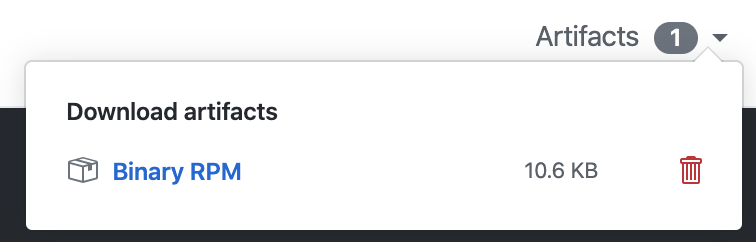
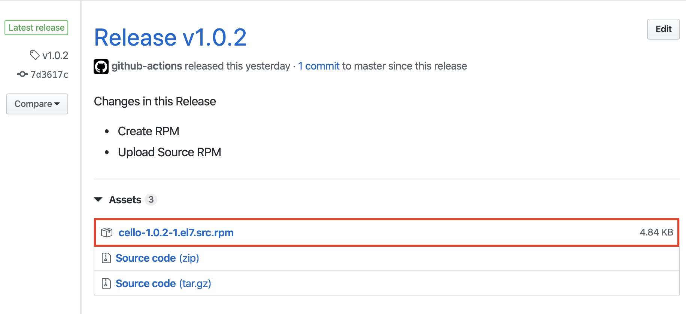

# GitHub Action - RPM Build  

This GitHub Action builds RPMs from spec file and using repository contents as source (wraps the rpmbuild utility).
Integrates easily with GitHub actions to allow RPMS to be uploaded as Artifact (actions/upload-artifact) or as Release Asset (actions/upload-release-asset).


## Usage
### Pre-requisites
Create a workflow `.yml` file in your repositories `.github/workflows` directory. An [example workflow](#example-workflow---build-rpm) is available below. For more information, reference the GitHub Help Documentation for [Creating a workflow file](https://help.github.com/en/articles/configuring-a-workflow#creating-a-workflow-file). 

**Note:** You need to have a spec file in order to build RPM.


### Inputs

- `spec_file`: The path to the spec file in your repo. [**required**]
- `additional_repos`: A list of additional repositories (in JSON-array format) that you want enabled to build your rpm. [**optional**]

### Outputs

- `rpm_dir_path`: path to RPMS directory
- `source_rpm_path`: path to Source RPM file
- `source_rpm_dir_path`: path to  SRPMS directory
- `source_rpm_name`: name of Source RPM file
- `rpm_content_type`: Content-type for RPM Upload

This generated RPMS and SRPMS can be used in two ways.
1. Upload as build artifact
    You can use GitHub Action [`@actions/upload-artifact`](https://www.github.com/actions/upload-artifact)
2. Upload as Release assest 
    If you want to upload as release asset ,You also will need to have a release to upload your asset to, which could be created programmatically by [`@actions/create-release`](https://www.github.com/actions/create-release) as show in the example workflow.

### Example workflow - build RPM

Basic:
```yaml
name: RPM Build
on: push

jobs:
  build:
    runs-on: ubuntu-latest
    steps:
    - uses: actions/checkout@v2

    - name: build RPM package
      id: rpm
      uses: naveenrajm7/rpmbuild@master
      with:
        spec_file: "cello.spec"
	additional_repos: "['centos-release-scl', 'http://www.percona.com/downloads/percona-release/redhat/0.1-3/percona-release-0.1-3.noarch.rpm']"

    - name: Upload artifact
      uses: actions/upload-artifact@v1.0.0
      with:
        name: Binary RPM
        path: ${{ steps.rpm.outputs.rpm_dir_path }}
```
This workflow triggered on every `push` , builds RPM and Source RPM using cello.spec and contents of that git ref that triggered that action. Contents are retrived through [GitHub API](https://developer.github.com/v3/repos/contents/#get-archive-link) [downloaded through archive link].  
The generated RPMs or SRPMS can be uploaded as artifacts by using actions/upload-artifact. The [outputs](#outputs) given by rpmbuild action can be used to specify path for upload action.

#### Above workflow will create an artifact like :



Use with Release:
```yaml
on:
    push:
      # Sequence of patterns matched against refs/tags
      tags:
        - 'v*' # Push events to matching v*, i.e. v1.0, v20.15.10
  
name: Create RPM Release

jobs:
    build:
        name: Create RPM Release
        runs-on: ubuntu-latest

        steps:

        - name: Checkout code
          uses: actions/checkout@master

        - name: Create Release
          id: create_release
          uses: actions/create-release@latest
          env:
              GITHUB_TOKEN: ${{ secrets.GITHUB_TOKEN }} # This token is provided by Actions, you do not need to create your own token
          with:
              tag_name: ${{ github.ref }}
              release_name: Release ${{ github.ref }}
              body: |
                Changes in this Release
                - Create RPM
                - Upload Source RPM
              draft: false
              prerelease: false
            
        - name: build RPM package
          id: rpm_build
          uses: naveenrajm7/rpmbuild@master
          with:
              spec_file: "cello.spec"
            
        - name: Upload Release Asset
          id: upload-release-asset 
          uses: actions/upload-release-asset@v1
          env:
              GITHUB_TOKEN: ${{ secrets.GITHUB_TOKEN }}
          with:
              upload_url: ${{ steps.create_release.outputs.upload_url }} # This pulls from the CREATE RELEASE step above, referencing it's ID to get its outputs object, which include a `upload_url`. See this blog post for more info: https://jasonet.co/posts/new-features-of-github-actions/#passing-data-to-future-steps 
              asset_path: ${{ steps.rpm_build.outputs.source_rpm_path }}
              asset_name: ${{ steps.rpm_build.outputs.source_rpm_name }}
              asset_content_type: ${{ steps.rpm_build.outputs.rpm_content_type }}
```

#### The above release uploads SRPM like :



Example Repository which uses rpmbuild action https://github.com/naveenrajm7/cello

Note on distribution:
If your RPMs are distribution specific like el7 or el8.  
- Use naveenrajm7/rpmbuild@master for Centos7 *[el7]*
- Use naveenrajm7/rpmbuild@centos8 for Centos8 *[el8]*

```yaml
- name: build RPM package
    id: rpm_build
    uses: naveenrajm7/rpmbuild@centos8
    with:
        spec_file: "cello.spec"
```

## Contribute

Feel free to contribute to this project. Read [CONTRIBUTING Guide](CONTRIBUTING.md) for more details.
## References

* [RPM Packaging Guide](https://rpm-packaging-guide.github.io/)
* [GitHub Learning Lab](https://lab.github.com/)
* [Container Toolkit Action](https://github.com/actions/container-toolkit-action)

## License

The scripts and documentation in this project are released under the [GNU GPLv3](LICENSE)

*Created during the GitHub Actions Hackathon 2020 :octocat: :computer: .*  
*Made it to the [winner's list](https://docs.google.com/spreadsheets/d/1YL6mjJXGt3-75GejQCubsOvWwtYcGaqbJA7msnsh7Tg/edit?usp=sharing) (See Row no. 291!) :trophy: :medal_sports:*
